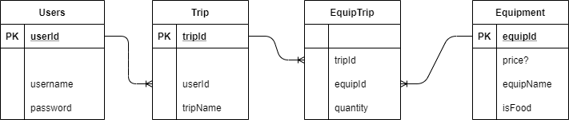

# Travel Planner
## Description

The purpose of this application is to aid those planning camping trips to create a budget.
This will allow them to plan out the food and the equipment they wish to take with them.

The technologies I used to create this are Maven, Tomcat Server, Java 8, JDBC, Postgresql, Jackson Databind/core, bcrypt, jUnit
##SQL Diagram

## Api Description
### /Login
The user may login in with this. The user needs to log in to access any of the functions after this.
### /Logout
Logs a user out of the programming, invalidating their session
### /Login/CreateUser
This allows a user to make an account
### /Create/Trip
This will allow the user to create a trip instance within their account
### /Trip/All
This gets a list of all the trips owned by the user.
### /Trip
This will allow the user to select a trip to edit.
### /Item/All
This gets a list of all the items the user can add to their trip.
### /Trip/Item/Add
This will add an item to the user's selected trip.
### /Trip/Edit
This allows the user to edit the names of the trips they create.
They need to login and then select the trip they wish to edit. From there they can use this command to change the name of that session.
## Future Improvements
There is a frame work to delete trips, delete items, and to show items. The servlets have either not been created or the routing for this functionality isn't set up yet.